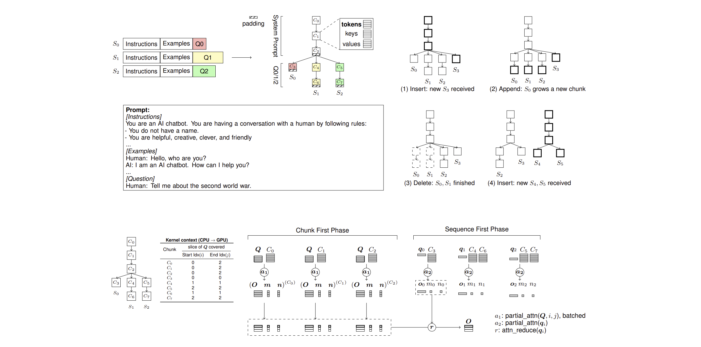

# Chunk Attention

**ChunkAttention: Efficient Self-Attention with Prefix-Aware KV Cache and Two-Phase Partition**  
Paper: [https://arxiv.org/abs/2402.15220](https://arxiv.org/abs/2402.15220)


## Example: Integrate ChunkAttn into Production LLMs

We provide an example in chunk-attn package (src/chunk_attn/models/llama_hf/modeling_llama.py) to show how to integrate ChunkAttn into production LLMs. The example is built on top of Huggingface Llama and vLLM's optimized kernels (layer normalization and rotary embedding), but the attention module is substituted by ChunkAttn. The following code demonstrates how to use the example to create LLaMA model with ChunkAttn and run asynchronous inference.

```python
from chunk_attn.models.llama_hf import LlamaConfig, LlamaTokenizer, LlamaForCausalLM
from chunk_attn.models.model_host import ModelHost

model_path = 'openlm-research/open_llama_7b'    
tokenizer = LlamaTokenizer.from_pretrained(model_path)
config = LlamaConfig.from_pretrained(model_path)
config.torch_dtype = torch.float16
config.torch_device = torch.device('cuda:0')       

model = LlamaForCausalLM.from_pretrained(
    model_path,
    config=config,
    torch_dtype=config.torch_dtype,
    device_map=config.torch_device)
kv_caches = model.create_kv_caches()

with ModelHost(model, kv_caches, max_batch_size=16) as host:
    futures = []
    system_prompt = 'You are a chatbot and you are talking to an user. The user will ask you a question and you will answer it. You should answer the question in a friendly way. Do not use offensive words.'
    for i in range(16):
        prompt_tokens = tokenizer(f'{system_prompt}\nQ{i}: What is black hole?\nA: ', return_tensors="pt").input_ids.tolist()[0]
        f = host.predict_async(prompt_tokens, 32)
        futures.append(f)
    
    for f in futures:
        print(tokenizer.decode(f.get_result()) + '\n')
```

## Build from Source

### GPU Kernel (BLAS=CUDA)

During the writing of this paper, CUDA 11.8 was used. Since then, many packages have released new versions. The latest configuration we have verified on Ubuntu 22.04 (kernel version 6.5.0) includes CUDA 12.4, PyTorch 2.5.1, and Python 3.10.

Please note: 1) If you are using other versions, you may need to apply fixes to compile successfully, and performance results may vary slightly. 2) We have not continuously verified the compatibility of baseline packages (such as xformers, vllm, etc.) with the above configuration, so benchmark tests involving them may require additional fixes to run.

```bash
# install gcc, make and etc.
sudo apt-get update && sudo apt install build-essential cmake
python3 -m pip install --upgrade pip mypy

# install cuda: https://developer.nvidia.com/cuda-12-4-0-download-archive?target_os=Linux&target_arch=x86_64&Distribution=Ubuntu&target_version=22.04&target_type=runfile_local

# install pytorch
pip3 install torch==2.5.1 --index-url https://download.pytorch.org/whl/cu124

# Find your PyTorch installation path to build and install ChunkAttn
python3 -c 'import torch.utils; print(torch.utils.cmake_prefix_path)'
cmake -S . -B build -DTORCH=</path/to/python>/site-packages/torch -DUSE_MKL=OFF -DUSE_CUDA=ON -DCMAKE_BUILD_TYPE=Release
cmake --build build

python tests/test_chunk_attn_cuda.py
```

### CPU Kernel (BLAS=MKL) [Experimental]

```bash
# sudo apt install intel-oneapi-mkl-devel
# by default, MKL_LINK=dynamic, MKL_THREADING=parallel, we should change them.
cmake -S . -B build -DTORCH=</path/to/python>/site-packages/torch -DUSE_MKL=ON -DUSE_CUDA=OFF -DMKL_LINK=static -DMKL_THREADING=sequential -DCMAKE_BUILD_TYPE=Release
cmake --build build

# Windows
# cmake -S . -B build -DTORCH=</path/to/python>/site-packages/torch -DUSE_MKL=ON -DUSE_CUDA=OFF -DMKL_LINK=static -DMKL_THREADING=sequential
# cmake --build build --config RelWithDebInfo

python tests/test_chunk_attn_cpu.py
```

## Tips

**Using PyTorch Context Manager**

PyTorch has a context manager which can take care of the device transfer automatically. ChunkAttn is compatible with this context manager.

```Python
from chunk_attn import Attention

with torch.device('cuda'):
    attn = Attention(n_heads=32, d_head=128, chunk_size=32)
```

In C++, you can use `c10::DeviceGuard` to switch the device. It is a RAII guard that sets a certain default device in its constructor, and changes it back to the device that was originally active upon destruction.
```C++
#include "c10/core/DeviceGuard.h"

{
    c10::DeviceGuard guard(torch::Device(torch::kCUDA, 1));
    Attention attn(32, 128, 32);
}
```

**Add nvcc to PATH if not already**

```bash
export PATH="/usr/local/cuda/bin:$PATH"
```

**Change HuggingFace Cache Path**

```bash
export TRANSFORMERS_CACHE=/mnt/huggingface/
```

## Citation
    
```bibtex
@misc{ye2024chunkattention,
      title={ChunkAttention: Efficient Self-Attention with Prefix-Aware KV Cache and Two-Phase Partition}, 
      author={Lu Ye and Ze Tao and Yong Huang and Yang Li},
      year={2024},
      eprint={2402.15220},
      archivePrefix={arXiv},
      primaryClass={cs.LG},
      url={https://arxiv.org/abs/2402.15220}, 
}
```
